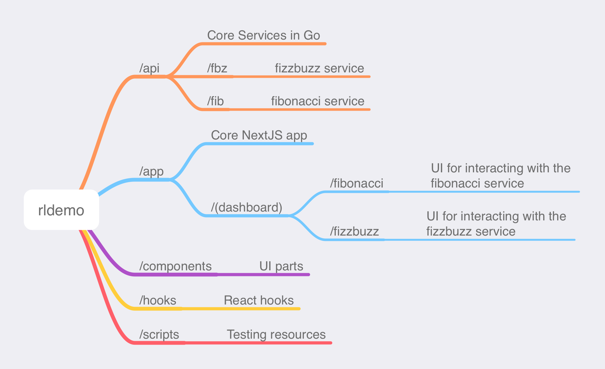

# rldemo

## Overview

This is a demo project.

## Getting Started

Copy or rename `.env.example` to `.env.local`.

Run:

``` bash
pnpm install
# then
pnpm dev
```

### Local API testing

In the env.local, swap out the `santee.cloud` endpoints for the `localhost` endpoints, then in another console window, run 
```bash
npm run api
```

> Don't have `pnpm`? [Find it here](https://pnpm.io/installation).

> Don't want `pnpm`? `npm install` and `npm run dev` will have the same effect!

You should now be able to access the application at <http://localhost:3000>.

## Architecture

The application consists of a NextJS front-end, and serverless services in Go implementing the core business logic. It is designed to deploy to [Vercel](https://vercel.com/home).

The project started with the [NextJS Admin Dashboard](https://vercel.com/templates/next.js/admin-dashboard) template (you may see a few traces of the boilerplate hanging around).

Illustration of the project structure:


## Requirements

### Where are they implemented?

They are split between the UI and the serverless services.

There are two services, they live under `/api`.

`/api/fbz` implements the FizzBuzz logic, and `/api/fib` implements the Fibonacci logic.

The UI is implemented in the NextJS app, in TypeScript, with React, supported by assorted libraries. The pages live under `/app/(dashboard)`.

Be sure to look for the gear icon in each UI, as some requirements are hiding there!

| Requirement | Implemented at             | ~~View Live~~                               |
|-------------|----------------------------|-----------------------------------------|
| Part 1      | /app/(dashboard)/fizzbuzz  | ~~<https://rldemo.santee.cloud/fizzbuzz>~~  |
| Part 2      | /app/(dashboard)/fibonacci | ~~<https://rldemo.santee.cloud/fibonacci>~~ |
| Part 3      | /app/(dashboard)/fizzbuzz  | ~~<https://rldemo.santee.cloud/fizzbuzz>~~  |

### Why this stack?

The stack was chosen because the organization was interested in NextJS. 

## Notes

Ran into this issue with apparent misconfiguration of tsconfig.json.
<https://github.com/shadcn-ui/ui/issues/1092>

## TODO
 - (Dashboard) route group is unnecessary
   - https://nextjs.org/docs/app/getting-started/project-structure#routing-files
 - Remove a `types.ts` from one of `/fibonacci` or `/fizzbuzz` and use a common copy
 - customize `/app/error.tsx/`
 - extract `about.tsx` to a common component that takes props
    - https://react.dev/learn/passing-props-to-a-component#step-2-read-props-inside-the-child-component
 - UI should reflect `1000000` maximium input to fibonacci
